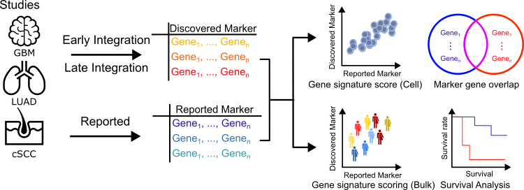

# Documentation

CanSig is a package to compare methods for discovering shared transcriptional states in cancer.



::::{grid} 2
:gutter: 1

:::{grid-item-card} Getting started {octicon}`plug;1em;`
:link: getting_started
:link-type: doc

Check out how to install the necessary environments and download datasets from the currated cancer cell atlas.

:::

:::{grid-item-card} Tutorials {octicon}`info;1em;`
:link: tutorials/index
:link-type: doc

The tutorials provide information on running CanSig on new datasets, adding your own method to the benchmark, and reproducing the results from our paper.

:::
:::{grid-item-card} API reference {octicon}`book;1em;`
:link: getting_started
:link-type: doc

Detailed overview of modules and functions in CanSig.
:::
:::{grid-item-card} GitHub {octicon}`mark-github;1em;`
:link: https://github.com/boevalab/cansig-benchmark

Found a Bug? Facing issuses installing packages? Let us know! We are happy to help.

::::


```{toctree}
:hidden: true
:maxdepth: 3
:titlesonly: true

getting_started
ccca
tutorials/index
api/index
cite
```